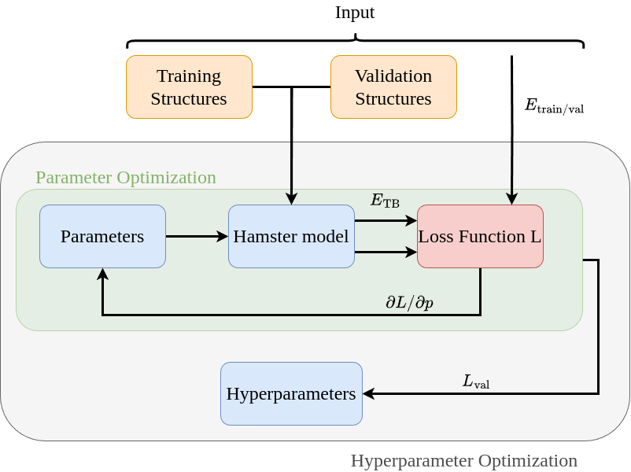

# Hamster.jl

[](https://github.com/mschwade-code/Hamster.jl/actions/workflows/runtests.yaml)
[](https://codecov.io/gh/TheoFEM-TUM/Hamster.jl)
[](https://theofem-tum.github.io/Hamster.jl/dev/)
[](https://tokei.rs/b1/github/TheoFEM-TUM/Hamster.jl)

<p align="center">
  
</p>

**H**amiltonian-learning **A**pproach for **M**ultiscale **S**imulations using a **T**ransferable and **E**fficient **R**epresentation

`Hamster.jl` is a pure-Julia package for fitting and running physics-informed effective Hamiltonian models to study temperature-dependent optoelectronic properties with linear scaling in the number of atoms. Originally created by Martin Schwade and developed by the [TheoFEM group](https://theofem.de/) at TU Munich (Prof. D. A. Egger), it implements a Δ-machine-learning approach to correct tight-binding Hamiltonians in response to changes in the atomic environment and including spin–orbit coupling (SOC).

📖 [Documentation](https://theofem-tum.github.io/Hamster.jl/dev/)

## Hardware requirements

The hardware requirements for running `Hamster.jl` are moderate, but they strongly depend on the system size. Small systems with only a few atoms typically finish in under 10 minutes on a standard personal computer. Larger calculations involving thousands of atoms are best run on dedicated workstations or clusters, where they may take several hours. Note that GPUs are currently not supported.

## Installation & Dependencies

To get started, you need a working [Julia](https://julialang.org/install/) installation. `Hamster.jl` is tested with Julia **v1.11.5** on **Ubuntu 22.04 LTS (Jammy Jellyfish)**. If you are using a different Julia version or operating system, please verify on your own that everything works as expected (e.g., by running the test suite or one of the [examples](https://theofem-tum.github.io/Hamster.jl/dev/examples/examples/)).

Since `Hamster.jl` is not (yet) a registered Julia package, we provide an installation script that sets up all dependencies, updates your `PATH`, and creates the `hamster` executable.

The script accepts the following optional keywords:
- `add_path`: `yes` or `no` (default: `yes`). If enabled, the location of the `Hamster.jl` folder is added to your `.bashrc`.  
- `bashrc`: Path to the `.bashrc` (or an alias file). Defaults to `$HOME/.bashrc`.  
- `exec_name`: Name of the executable (default: `hamster`).  
- `add_test_exec`: Boolean (default: `false`). If `true`, also creates a `hamster_test` executable for running the test suite.

```bash
julia hamster_install.jl [--add_path yes/no] [--bashrc default] [--exec_name hamster] [--add_test_exec]
```

Installing dependencies and running the test suite may take up to 10 minutes. A detailed list of dependencies can be found in the 
`Project.toml` file.

## Quickstart

You can run start Hamster by calling the `hamster` executable. To make use of MPI parallelization you need add `mpiexecjl` or `srun` in front.

```bash
[mpiexecjl -n NRANKS / srun] hamster [kwargs]
```

While keyword arguments can be passed directly via the command line, it is more practical to provide Hamster with a [config file `hconf`](https://theofem-tum.github.io/Hamster.jl/dev/conf/config/). Examples that can be run on a personal computer in under 10 minutes are available [here](https://theofem-tum.github.io/Hamster.jl/dev/examples/examples/).

## Code functionality

An effective Hamiltonian model in `Hamster.jl` consists of three building blocks: TB [1], ML [2], and SOC [2]. These components can be combined, trained individually, extended, or replaced (e.g., by a different ML model) in a modular fashion. Each block has its own hyperparameters (except for SOC), which should be optimized in advance (see flowchart below).

The input to the model is a set of atomic configurations, which can be provided in VASP file format or an h5 file (see [here](https://theofem-tum.github.io/Hamster.jl/dev/conf/block_tags/#Hamster.get_xdatcar-Tuple{Config})).
For [optimization](https://theofem-tum.github.io/Hamster.jl/dev/calc/optim/), two datasets of energy eigenvalues (training and validation), typically obtained from DFT, are also required.
For more details on hyperparameter optimization, please check the [documentation](https://theofem-tum.github.io/Hamster.jl/dev/calc/hyperopt/)

<p align="center">
  
</p>

For the results shown in Ref. 2, Hamster configuration (`hconf`) files are provided [here](https://github.com/TheoFEM-TUM/Hamster.jl/tree/devel/examples/hamster_paper_input).

## License
This project is licensed under the MIT License.

## Citing
If you use `Hamster.jl` in your work, please cite our work.  
A list of relevant publications is provided below.

## Publications

[1] [M. Schwade, M. J. Schilcher, C. Reverón Baecker, M. Grumet, and D. A. Egger, J. Chem. Phys. 160, 134102 (2024)](https://pubs.aip.org/aip/jcp/article/160/13/134102/3280389/Temperature-transferable-tight-binding-model-using)

[2] [M. Schwade, S. Zhang, F. Vonhoff, F. P. Delgado, D. A. Egger, arXiv:2508.20536 [cond-mat.mtrl-sci] (2025)](https://arxiv.org/abs/2508.20536)